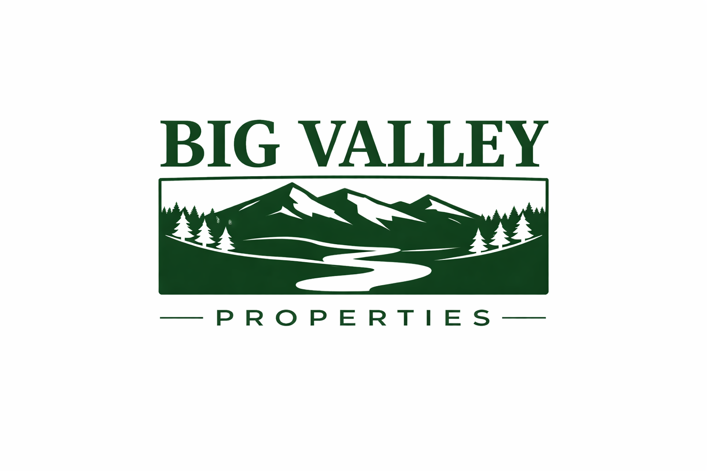

# Big Valley Properties — Website

A modern, high-performance real estate website for **Big Valley Properties**, the top-selling brokerage in Trinity County, California. Built with Next.js 14, TypeScript, and Tailwind CSS.



## ✨ Features

- **Homepage** — Hero section, broker spotlight, featured properties, county sections, testimonials
- **Property Listings** — Filterable grid with county, price, type, and acreage filters
- **Property Detail Pages** — Image gallery with lightbox, property info, agent contact, video placeholder, map placeholder, social share buttons
- **Agent Profiles** — Individual pages with bio, specialties, social links, and their listings
- **About Page** — Company story, service areas (Trinity & Shasta Counties), team overview
- **Contact Page** — Contact form (UI), office information, map placeholder
- **Responsive Design** — Optimized for mobile, tablet, and desktop
- **Brand-Compliant** — Uses official BVP 2026 color palette, typography (Tenor Sans, Montserrat, Playfair Display), and design tokens

## 🛠 Tech Stack

- **Framework:** Next.js 14 (App Router)
- **Language:** TypeScript
- **Styling:** Tailwind CSS 3
- **Fonts:** Google Fonts (Tenor Sans, Montserrat, Playfair Display)
- **Images:** Next.js Image optimization (AVIF/WebP)

## 📁 Project Structure

```
src/
├── app/
│   ├── page.tsx              # Homepage
│   ├── layout.tsx            # Root layout (header + footer)
│   ├── globals.css           # Global styles + design tokens
│   ├── properties/
│   │   ├── page.tsx          # Property listings with filters
│   │   └── [id]/
│   │       ├── page.tsx      # Property detail (server)
│   │       └── PropertyDetailClient.tsx  # Client interactivity
│   ├── agents/
│   │   ├── page.tsx          # Team overview
│   │   └── [slug]/page.tsx   # Agent profile
│   ├── about/page.tsx        # About page
│   └── contact/page.tsx      # Contact page
├── components/
│   ├── Header.tsx            # Sticky navigation
│   ├── Footer.tsx            # Site footer
│   ├── PropertyCard.tsx      # Property card component
│   └── AgentCard.tsx         # Agent card component
├── data/
│   ├── properties.ts         # Mock property data (10 listings)
│   └── agents.ts             # Mock agent data (4 agents)
└── lib/                      # Utility functions (future)
```

## 🚀 Getting Started

### Prerequisites
- Node.js 18+ 
- npm or yarn

### Installation

```bash
# Clone the repository
git clone https://github.com/teamrazo/Big-Valley-Properties.git
cd Big-Valley-Properties

# Install dependencies
npm install

# Run development server
npm run dev
```

Open [http://localhost:3000](http://localhost:3000) in your browser.

### Build for Production

```bash
npm run build
npm start
```

## 🌐 Deploy to Vercel

This project is configured for seamless deployment on Vercel:

1. Push to GitHub: `git push origin main`
2. Connect the repo to Vercel at [vercel.com](https://vercel.com)
3. Vercel auto-detects Next.js and deploys

Or deploy manually:
```bash
npx vercel --prod
```

## 🎨 Brand Guidelines

| Color | Hex | Usage |
|-------|-----|-------|
| Forest Green | `#10401c` | Primary brand |
| Deep Pine | `#1e4c2a` | Hover / secondary |
| Charcoal Ink | `#212121` | Primary text |
| Warm Alabaster | `#fdfdfd` | Background |
| River Stone | `#7c9a85` | Muted sage accent |
| Cabin Timber | `#595147` | Footer / warm brown |
| Alpine Slate | `#59687b` | Cool accent |
| Canvas Sand | `#f1f5f0` | Alt section BG |

**Typography:**
- Headings: Tenor Sans 400
- Body: Montserrat 400/500/700
- Accents: Playfair Display (italic quotes)

## 📋 Phase 1 Status (Current)

- [x] Homepage with all sections
- [x] Property listings with filters
- [x] Property detail pages with gallery
- [x] Agent profiles
- [x] About page
- [x] Contact page
- [x] Responsive design
- [x] Mock data (10 properties, 4 agents)

## 🔮 Future Phases

- [ ] Sanity CMS integration
- [ ] MLS/IDX integration
- [ ] Agent authentication & dashboard
- [ ] Lead capture & CRM integration
- [ ] Blog / content hub
- [ ] Home valuation tool
- [ ] Interactive maps
- [ ] Social sharing functionality

## 📄 License

© 2026 Big Valley Properties. All rights reserved.

---

**Built by RazorSharp Networks** for Big Valley Properties
